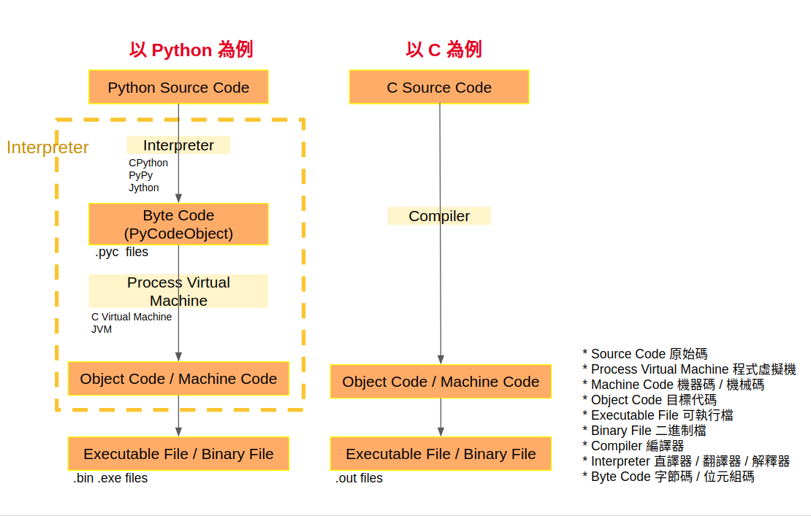
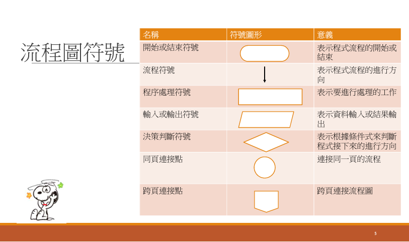
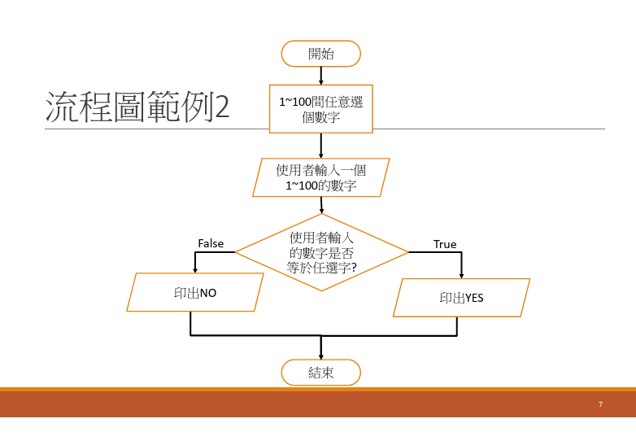

# Python 教學

這是為了 Steven 和 Roger 特地設計的課程，希望他們可以在初學階段對 Python 或是寫程式感興趣。

## Roadmap

> 前期提要

1. [甚麼是 Python](#甚麼是-python)
2. [Python 是怎麼運行的](#python-是怎麼運行的)
3. [畫畫流程圖](#畫畫流程圖)
4. [Python 環境怎麼設定](#python-環境怎麼設定)

> 正式開始

5. [資料型別](#資料型別)
6. [語法觀念](#語法觀念)
7. [函式操作](#函式操作)
8. [內建函式](#內建函式)

---

## 甚麼是 Python

Python 是一種高階程式語言，由 Guido van Rossum 在 1991 年發表。它的設計哲學強調程式碼的可讀性和簡潔性，使得程式開發更快速、更容易維護。

Python 支援多種程式範式，包括面向對象、命令式和函數式編程。它有著龐大的標準庫和活躍的社群，適用於網頁開發、數據分析、人工智慧等多個領域。

Python 的語法簡潔明瞭，易於學習和使用。它的動態類型系統和自動記憶體管理功能，使得開發者可以專注於程式邏輯，而不必過多關注底層細節。

[參考資料：Oxxo Studio](https://steam.oxxostudio.tw/category/python/info/index.html)

## Python 是怎麼運行的

Python 程式碼是由 Python 解譯器執行的。當你撰寫一段 Python 程式碼並執行時，解譯器會將程式碼轉換成機器可以理解的指令。
這個過程通常包括以下幾個步驟：

1. **寫程式碼**：你使用 Python 語言撰寫程式碼，通常儲存在 `.py` 檔案中。
2. **直譯器讀取程式碼**：當你執行 Python 程式時，Python 直譯器會讀取這些程式碼。
3. **語法分析**：直譯器會檢查程式碼的語法是否正確，並將其轉換成內部表示形式。
4. **執行程式碼**：直譯器會逐行執行程式碼，將其轉換成機器指令並執行。這意味著 Python 是一種解譯型語言，而不是編譯型語言。
5. **輸出結果**：程式執行後，直譯器會將結果輸出到終端或其他介面。

這種運行方式使得 Python 程式碼可以在不同的平台上執行。


## 畫畫流程圖

- [流程圖工具](https://miro.com/)
- [Lucidchart](https://www.lucidchart.com/)
- [Draw.io](https://app.diagrams.net/)




## Python 環境怎麼設定

### MacOS

- [於 macOS 使用 Python](https://docs.python.org/zh-tw/3.13/using/mac.html)
- [在 Mac 系統使用 Python](http://docs.python.org/zh-tw/3.12/using/mac.html)

---

## 資料型別

1. 變數（區域、全域）
   - 區域變數：在函式內部定義的變數，作用域僅限於函式內部。
   - 全域變數：在函式外部定義的變數，作用域為整個程式。
2. 數字（整數、浮點數）

   - 整數：沒有小數點的數字，如 `1`, `42`, `-7`。
   - 浮點數：有小數點的數字，如 `3.14`, `-0.001`, `2.0`。

   | 運算子 | 說明                     | 範例     | 結果 |
   | ------ | ------------------------ | -------- | ---- |
   | +      | 加法                     | 1 + 2    | 3    |
   | -      | 減法                     | 20 - 12  | 8    |
   | \*     | 乘法                     | 2 \* 3   | 6    |
   | /      | 除法                     | 9 / 2    | 4.5  |
   | //     | 除法取整數（無條件捨去） | 9 // 2   | 4    |
   | %      | 餘數                     | 9 % 2    | 1    |
   | \*\*   | 次方                     | 2 \*\* 3 | 8    |

3. 字串（單引號、雙引號、三引號）

   - 單引號：`'Hello'`
   - 雙引號：`"World"`
   - 三引號：

   ```python
   '''This is a multi-line string'''
   ```

   ```python
   """This is also a
   multi-line string""" #  用於多行字串。
   ```

4. 布林值（True、False）
   - True：表示真。
   - False：表示假。
5. 列表（List）
   - 有序的元素集合，可以包含不同類型的資料，如 `[1, 2, 3]`, `['a', 'b', 'c']`。
   - 可以使用索引存取元素，如 `my_list[0]` 取得第一個元素。
   - 支援切片操作，如 `my_list[1:3]` 取得第二到第三個元素。
   - 可以使用 `append()` 方法新增元素，如 `my_list.append(4)`。
6. 元組（Tuple）
   - 與列表類似，但不可變，定義後無法修改，如 `(1, 2, 3)`, `('a', 'b', 'c')`。
   - 使用索引存取元素，如 `my_tuple[0]` 取得第一個元素。
   - 支援切片操作，如 `my_tuple[1:3]` 取得第二到第三個元素。
7. 集合（Set）
   - 無序且不重複的元素集合，如 `{1, 2, 3}`, `{'a', 'b', 'c'}`。
   - 可以使用 `add()` 方法新增元素，如 `my_set.add(4)`。
   - 支援集合運算，如聯集、交集、差集等。
8. 字典（Dictionary）
   - 由鍵（Key）和值（Value）組成的無序集合，如 `{'name': 'Alice', 'age': 30}`。
   - 可以使用鍵存取對應的值，如 `my_dict['name']` 取得 'Alice'。
   - 支援新增、刪除和修改鍵值對。
9. None（空值）
   - 表示沒有值或空值，通常用於函式沒有返回值時。
   - 可以用於初始化變數，如 `my_var = None`。
10. 其他（如日期、時間等）
    - Python 提供了 `datetime` 模組來處理日期和時間。
    - 可以使用 `datetime.datetime.now()` 取得當前時間。
    - 支援日期和時間的加減運算。

## 語法觀念

1. 縮排

   - Python 使用縮排來表示程式區塊，通常使用四個空格或一個 Tab。
   - 縮排不正確會導致語法錯誤。

   ```python
   # 正確的縮排
   def my_function():
       print("Hello, World!")

    # 錯誤的縮排
    def my_function():
    print("Hello, World!")  # 這會導致語法錯誤
   ```

2. 註解

   - 單行註解使用 `#`，多行註解使用三引號。

   ```python
    # 這是一個單行註解

    '''    這是一個多行註解
    '''
   ```

3. 運算子
   - 算術運算子：`+`, `-`, `*`, `/`, `//`, `%`, `**`
   - 比較運算子：`==`, `!=`, `<`, `>`, `<=`, `>=`
   - 邏輯運算子：`and`, `or`, `not`
   - 位元運算子：`&`, `|`, `^`, `~`, `<<`, `>>`
4. 條件語句

   - 使用 `if`, `elif`, `else` 來實現條件判

   ```python
   my_fruit = "apple"
   if my_fruit == "apple":
       # 條件為真時執行
       print("這是一顆蘋果！")
   elif my_fruit == "banana":
       # 另一個條件為真時執行
       print("這是一根香蕉！")
   else:
       # 所有條件都不成立時執行
       print("這不是蘋果也不是香蕉！")
   ```

5. 迴圈

   - `for` 迴圈：用於遍歷序列（如列表、字串等）。

   ```python
   for item in my_list:
       print(item)
   ```

   - `while` 迴圈：在條件為真時重複執行。

   ```python
   while condition:
       print("Looping...")
   ```

6. 函式

   - 使用 `def` 關鍵字定義函式。

   ```python
   def my_function():
       print("Hello, World!")
   ```

   - 可以有參數和返回值。

   ```python
   def add(a, b):
       return a + b
   result = add(2, 3)  # result 為 5
   ```

## 函式操作

（內文）

## 內建函式

（內文）

## 參考資料

- [教學參考網站](https://steam.oxxostudio.tw/category/python/info/start.html)
